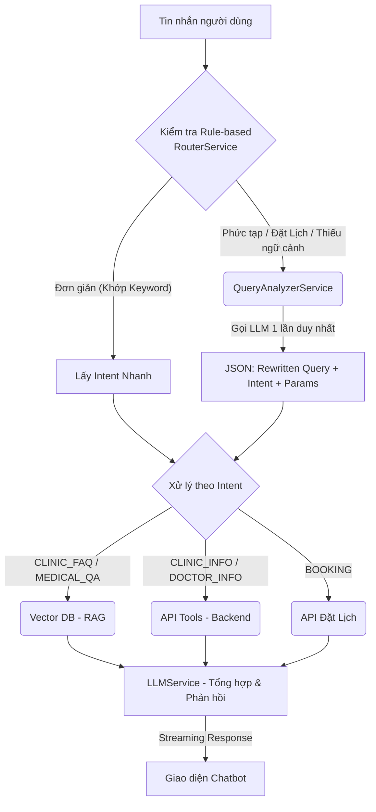

# Kiến trúc Hệ thống Bot AI (Langchain & FastAPI)

Tài liệu này mô tả kiến trúc tổng thể, luồng xử lý dữ liệu và cách vận hành của hệ thống Clinic AI Chat, bao gồm cả các bản cập nhật mới nhất về tối ưu hóa mô hình và tốc độ phản hồi.

## 1. Thành phần Cốt lõi
- **Framework Backend:** FastAPI (xử lý API tốc độ cao, hỗ trợ Streaming), Langchain (luồng AI, RAG).
- **LLM Engine:** Sử dụng Local Model thông qua **Ollama**.
- **Mô hình AI (Fine-tuned):** `clinic-ai-F16.gguf`
  - Mô hình gốc: `Qwen/Qwen2.5-3B-Instruct`.
  - Được huấn luyện (Fine-tune PEFT/LoRA) trên tập dữ liệu 9400 câu hỏi y khoa (`hungnm/vietnamese-medical-qa`) thông qua Kaggle.
  - Đã được gộp (Merge) khối LoRA và ép sang định dạng `.gguf` (F16) siêu nhẹ để chạy mượt mà ngay trên máy cá nhân/server nội bộ.
- **Vector Database (RAG):** ChromaDB.
  - *Embedding Model:* `nomic-embed-text`.
  - *Cross-encoder (Re-ranker):* `ms-marco-MiniLM-L-6-v2` chấm điểm lại độ chính xác để chọn bối cảnh phù hợp nhất.

---

## 2. Luồng Xử Lý Truy Vấn (Query Workflow)

Hệ thống áp dụng kiến trúc **One-Shot LLM Call** kết hợp **Fast Rule-based** để tối ưu hóa thời gian phản hồi (Time To First Token - TTFT) tối đa.



### Chi tiết các bước xử lý:
1. **Kiểm tra nhanh (Rule-based):** Tin nhắn đi qua regex/keyword để quét Intent sơ bộ. Nếu là câu đơn giản (chào hỏi, hỏi chuyên khoa trực tiếp), nó lấy Intent ngay lập tức (0s).
2. **Unified Query Analyzer:** Đối với câu hỏi mập mờ, mất ngữ cảnh hoặc cần lấy tham số phức tạp (đặt lịch), `QueryAnalyzerService` sẽ gọi LLM **1 lần duy nhất** để ép trả về JSON chứa đủ 3 thông tin:
   - *Câu viết lại (Rewritten Query)*
   - *Intent (Ý định thực sự)*
   - *Parameters (Tên bác sĩ, giờ khám, ngày, chuyên khoa...)*
3. **Gọi Tool hoặc RAG:** Dựa vào Intent để bóc tách tài liệu từ ChromaDB hoặc gọi thẳng sang Database thực tế.
4. **Streaming Response:** LLM đưa ra câu trả lời cuối cùng và "chảy" từng chữ về cho Client qua Server-Sent Events (SSE).

---

## 3. Hệ thống Tool Calling (10 Tools)
Bot có khả năng gọi các "Hàm" (Tools) để thao tác với Backend của phòng khám thông qua Python Client:
1. `get_specialties_tool`: Liệt kê chuyên khoa.
2. `get_doctors_tool`: Tìm kiếm bác sĩ.
3. `get_services_tool`: Xem bảng giá dịch vụ.
4. `get_clinic_info_tool`: Xem thông tin phòng khám.
5. `get_available_slots_tool`: Quét giờ trống của bác sĩ.
6. `suggest_expertise_tool`: AI gợi ý chuyên khoa dựa vào triệu chứng.
7. `book_appointment_tool`: Đặt lịch (chặn Chủ Nhật, đặt trước 24h).
8. `get_my_appointments_tool`: Xem lịch sử đặt lịch.
9. `cancel_appointment_tool`: Hủy lịch.
10. `register_patient_tool`: Đăng ký tài khoản mới.

---

## 4. Tương tác với Backend Java & Mobile App
- Cửa ngõ API: `/api/v1/chat/send` và `/api/v1/chat/stream`.
- Python FastAPI sẽ nhận tin nhắn kèm **JWT Token** từ App/Web.
- Token này được nhúng thẳng vào Header khi Python gọi sang các API của Spring Boot Backend, đảm bảo mọi thao tác cá nhân (đặt/hủy lịch) đều được xác thực danh tính chặt chẽ.

---

## 5. Hướng dẫn Khởi chạy (Local)

Để chạy hệ thống AI với mô hình Fine-tuned mới nhất, thực hiện các bước sau:

**Bước 1: Nạp Mô hình vào Ollama**
Mở terminal tại thư mục gốc `clinic-ai-chat` và chạy lệnh sau để đọc `Modelfile` và import file `.gguf` vào hệ thống Ollama:
```bash
ollama create clinic-ai -f Modelfile
```

**Bước 2: Khởi động Server AI (FastAPI)**
Trong môi trường ảo (venv), khởi động FastAPI server:
```bash
venv\Scripts\activate
uvicorn app.main:app --reload --port 8000
```
*(Server AI sẽ chạy tại `http://localhost:8000`. Hãy đảm bảo Spring Boot Backend cũng đang chạy tại `http://localhost:8080`).*
