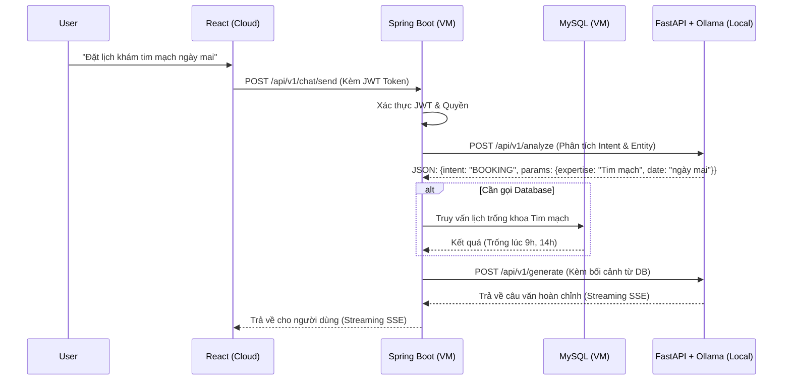

# Kế hoạch Kiến trúc Orchestration (Spring Boot làm Proxy & Orchestrator)

## 1. Mục tiêu
Chuyển đổi từ kiến trúc hiện tại (Frontend -> AI -> Backend) sang kiến trúc chuẩn Enterprise (Frontend -> Backend -> AI -> Backend). 
Spring Boot sẽ đóng vai trò **Orchestrator (Bộ điều phối)**, kiểm soát bảo mật, phân quyền và kết nối CSDL, trong khi AI Server (Local) chỉ đóng vai trò phân tích ý định (Intent), trích xuất tham số và sinh ngôn ngữ.

## 2. Luồng dữ liệu mới (Data Flow)

## 3. Các thay đổi cần thực hiện

### A. Phía AI Server (clinic-ai-chat - FastAPI)
1. **Chia tách Endpoint:** Thay vì 1 endpoint `/chat/send` làm tất cả, chia thành 2 endpoint:
   - `/api/v1/chat/analyze`: Nhận Text, trả về JSON (Intent, Parameters). KHÔNG gọi Tool.
   - `/api/v1/chat/generate`: Nhận Text + Ngữ cảnh (Knowledge/Data do Backend cung cấp), trả về câu trả lời văn bản (Hỗ trợ Streaming).
2. **Gỡ bỏ thư mục Tools:** AI Server không cần kết nối trực tiếp đến Backend API để gọi Tool nữa (xóa `app/tools/clinic_tools.py`, `app/clients/backend_client.py`).
3. **Bảo vệ Endpoint:** Chỉ chấp nhận request nếu có Secret Key từ Spring Boot (bảo mật lớp 2 sau Cloudflare Tunnel).

### B. Phía Backend (clinic-backend - Spring Boot)
1. **Tạo ChatController:** Xây dựng Controller `/api/v1/chat` để Frontend gọi vào.
2. **Xây dựng AIOrchestratorService:**
   - Nhận tin nhắn từ Frontend.
   - Gọi sang `/analyze` của AI (qua Cloudflare Tunnel `ai.duongquockiet.id.vn`).
   - Lấy JSON Intent, quyết định gọi Service/Repository nào trong Spring Boot để lấy dữ liệu (RAG, Lịch khám, Thông tin Bác sĩ...).
   - Bơm dữ liệu vừa lấy vào request gọi sang `/generate` của AI.
   - Trả luồng Streaming từ AI về thẳng Frontend (dùng `ResponseBodyEmitter` hoặc `SseEmitter`).
3. **Cấu hình Security:** Bảo vệ `/api/v1/chat` bằng Spring Security (chỉ user đã đăng nhập mới được chat nếu intent là BOOKING, hoặc public nếu intent là CLINIC_FAQ).

### C. Phía Frontend (clinic-frontend - React)
1. Đổi `VITE_AI_CHAT_URL` trỏ về API của Backend (VD: `https://api.duongquockiet.id.vn` hoặc IP của Backend).
2. Code Frontend giữ nguyên luồng SSE, chỉ đổi URL đích.

### D. Hạ tầng (Infrastructure)
1. **Cloudflare Tunnel:** Thiết lập tunnel trên máy Local của bạn:
   - Domain: `ai.duongquockiet.id.vn`
   - Target: `http://localhost:8000`
2. Update `.env` của Spring Boot để cấu hình URL của AI (trỏ vào `ai.duongquockiet.id.vn`).

## 4. Lộ trình triển khai
1. **Giai đoạn 1:** Xóa bỏ Tools API ở AI Server, xây dựng 2 endpoint `/analyze` và `/generate`.
2. **Giai đoạn 2:** Cài đặt Cloudflare Tunnel ở máy Local.
3. **Giai đoạn 3:** Code `ChatController` và Orchestration logic ở Spring Boot. Cấu hình Streaming proxy.
4. **Giai đoạn 4:** Sửa URL ở Frontend, test toàn bộ luồng.
