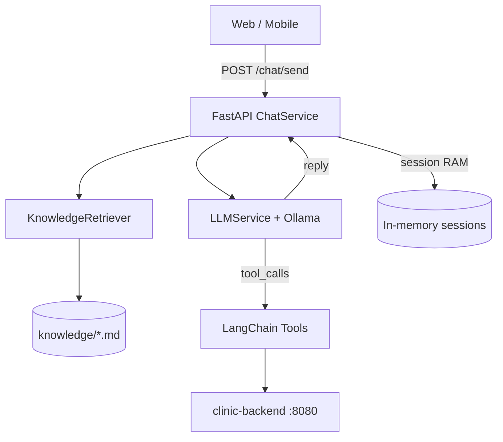

# Kiến trúc AI Chat (thực tế đang triển khai)

## 1. Mô hình Hybrid: Light RAG + Tool Calling

Hệ thống **không** dùng vector database phức tạp. Thay vào đó:

| Lớp | Công nghệ | Dùng cho |
|-----|-----------|----------|
| **Light RAG** | Chunk markdown + keyword search | FAQ, quy trình, gợi ý triệu chứng (tĩnh) |
| **Tool Calling** | LangChain + REST API backend | Bác sĩ, giá, dịch vụ, giờ trống, đăng ký (live) |
| **LLM** | Ollama Llama 3.2 3B | Hiểu câu hỏi, chọn tool, tổng hợp câu trả lời |



## 2. Luồng xử lý một tin nhắn

1. Client gửi `{ message, session_id }`
2. **ChatService** lấy lịch sử hội thoại (RAM, tối đa 10 lượt)
3. **KnowledgeRetriever** tìm 1–3 chunk FAQ liên quan (keyword overlap)
4. **LLMService** gửi: system prompt + FAQ context + history + tin nhắn → Ollama
5. Nếu LLM gọi tool → thực thi → gọi backend → LLM tổng hợp câu trả lời
6. Lưu history, trả `{ reply, session_id }`

## 3. Phân vai rõ ràng

### Dùng RAG (FAQ tĩnh) khi:
- Hỏi giờ làm việc, chính sách hủy lịch, thanh toán
- Hỏi quy trình đặt lịch chung
- Gợi ý chuyên khoa theo triệu chứng (tham khảo)

### Dùng Tool Calling khi:
- Cần tên bác sĩ, giá dịch vụ thực tế từ DB
- Kiểm tra giờ trống của bác sĩ cụ thể
- Đăng ký tài khoản guest

## 4. Tools hiện có

| Tool | Backend API |
|------|-------------|
| get_specialties_tool | GET /expertise/all |
| get_doctors_tool | GET /staffs/filter |
| get_services_tool | GET /services/all hoặc /featured |
| get_clinic_info_tool | GET /settings |
| get_available_slots_tool | GET /appointments/slots |
| register_patient_tool | POST /auth/patient/register |

## 5. Chưa triển khai (roadmap)

- Vector RAG (embedding + ChromaDB) cho tài liệu lớn
- Database lưu chat history
- WebSocket streaming thật
- Tool đặt lịch tự động (cần JWT bệnh nhân)
- Intent classifier riêng (LLM tự quyết định qua tool calling)

## 6. Cấu trúc mã nguồn

```
app/
├── api/v1/endpoints/chat.py    # REST API
├── services/
│   ├── chat_service.py         # Orchestrator (RAG + session)
│   └── llm_service.py          # Ollama + tool loop
├── rag/retriever.py            # Light RAG
├── tools/                      # LangChain tools
├── clients/backend_client.py   # HTTP → Spring Boot
└── core/prompts.py
knowledge/                      # FAQ markdown (chunked) — xem docs/knowledge-base.md
prompts/system.txt              # System prompt
```
