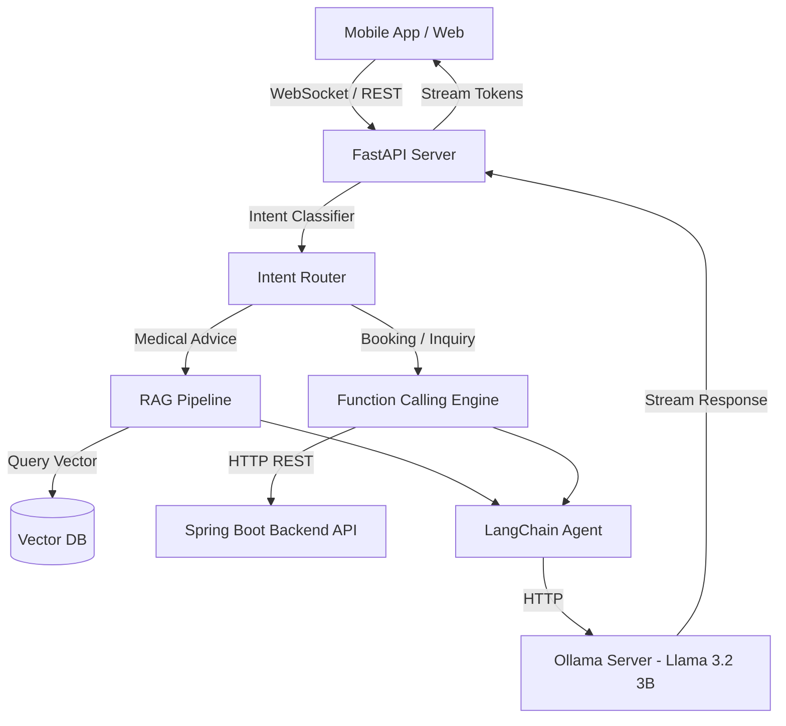

# 🏛️ Kiến trúc & Luồng xử lý (Architecture & Workflow)

Dự án áp dụng kiến trúc **Event-driven Agentic Workflow** kết hợp Rule-based Intent Routing để khắc phục điểm yếu của LLM nhỏ (3B params).

## 1. Sơ đồ Kiến trúc Tổng quan (System Architecture)

## 2. Giải pháp Intent Classifier (Phân loại ý định)
Vì Llama 3.2 3B khá nhỏ, việc phó mặc 100% Function Calling cho mô hình sẽ dễ sinh ra lỗi (Hallucination). Do đó, luồng xử lý:
1. **Bước 1 (Classifier):** Khi User nhắn tin, một mô hình phân loại nhỏ (hoặc prompt nhẹ) sẽ xác định Intent: `BOOK_APPOINTMENT`, `CHECK_RECORD`, `MEDICAL_ADVICE`, `GENERAL_INFO`.
2. **Bước 2 (Execution):** 
   - Nếu là `BOOK_APPOINTMENT`: Chạy luồng trích xuất Entity (Tên bác sĩ, Giờ, Chuyên khoa). Nếu thiếu thông tin -> Hỏi lại. Đủ thông tin -> Gọi Spring Boot API.
   - Nếu là `MEDICAL_ADVICE`: Kích hoạt RAG, tìm kiếm bài báo y khoa nội bộ / CSDL triệu chứng, nhồi vào Context cho Ollama trả lời.
3. **Bước 3 (Generation):** Ollama sinh câu trả lời tự nhiên dựa trên kết quả của Bước 2 và Stream về Client.
